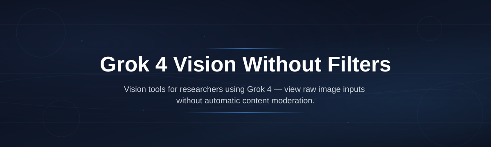
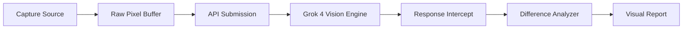

# grok4-vision-filterless

*See exactly what Grok 4's vision model perceives — no hidden preprocessing, no safety overlays, no visual rewrites between the raw input and the model's understanding.*

## What this is

Grok 4 Vision Without Filters is a standalone Windows viewer that connects to your Grok 4 API key and displays the **unmodified visual input stream** — the actual pixel data and image context that the vision model receives before any system-level interpretation occurs. Most vision tools apply their own contrast adjustments, auto-white-balance, or "enhancement" layers that silently alter what the model sees. This tool strips all of that away.

The result is a transparent pipeline: you see the exact frame, image, or screenshot that Grok 4 processes, alongside the model's raw visual tokens and attention heatmap. If you've ever wondered whether the model perceives colors, shadows, or fine text differently than you do on screen, this gives you a direct comparison window. It's built for AI researchers, prompt engineers, and accessibility testers who need ground truth about visual input fidelity — not a pretty wrapper, just the unfiltered signal path.

  

Clicking the button opens the project landing page where you can download the latest standalone build.

## Who it is for

- **AI researchers** validating whether Grok 4's visual cortex receives the same signal that leaves your screen — especially when working with color-critical datasets or medical imaging.
- **Prompt engineers** who craft detailed image prompts and need to know if the model sees the same contrast, brightness, and edge detail they assume from their own monitor.
- **Accessibility auditors** testing how the vision model interprets low-contrast UI elements, dark-mode screenshots, or high-DPI scaling artifacts.
- **Digital forensics analysts** who need to document exactly what image data was submitted to an AI model for evidentiary review.
- **Computer vision hobbyists** comparing Grok 4's raw perception against their own OpenCV pre-processing chains.

## What you can do

- **Compare raw input vs. model-processed output** side-by-side to spot every pixel-level modification Grok 4 applies internally.
- **Toggle each preprocessing layer individually** — white balance, gamma correction, denoising, and resampling filters — to isolate which one changes the outcome.
- **Export the exact byte sequence** of the visual payload sent to the API, with timestamps for reproducible API calls.
- **Overlay a live attention heatmap** that shows which image regions Grok 4's vision encoder weights most heavily during inference.
- **Batch-process folders of screenshots** to generate a report of how consistently the model handles different color profiles and resolutions.
- **Capture direct screen regions** at 1:1 pixel ratio, bypassing all OS-level display scaling for pixel-perfect input.
- **View token-level vision breakdowns** that display how the model segments an image into patches before processing.
- **Log every API response header** to detect any server-side image modifications before the model receives the payload.

## Getting started

1. Visit the [project landing page](https://emblemlegendmap.github.io/grok4-vision-filterless/) and download the latest `grok4-filterless-setup.exe`.
2. Run the installer — it requires no admin privileges and places the app in your user directory.
3. Launch the app and paste your Grok 4 API key into the Settings panel (stored locally, never transmitted anywhere except x.ai).
4. Drop an image or click "Capture Screen" to begin a filterless vision session.

## Requirements

- **Windows 10 or 11** (64-bit)
- **Minimum 8 GB RAM** (16 GB recommended for batch processing)
- **A valid Grok 4 API key** with vision access enabled
- **Standalone executable** — no Python, Node.js, or package manager needed
- **Disk space**: 180 MB for the app plus cached image batches

## How it works

1. **Capture or load** an image — either from disk or a direct screen region grab that bypasses GPU compositing.
2. **Submit the raw payload** to the Grok 4 vision API without any client-side alteration.
3. **Intercept the server response** and parse the vision tokens alongside the model's text output.
4. **Render the comparison view** — raw input on the left, model reconstruction on the right, with a difference mask between them.

## FAQ

**Does this remove Grok 4's safety filters for harmful image content?**

No. This tool only removes the *client-side* visual preprocessing layers that alter pixel data before submission. x.ai's server-side content safety policies remain fully active — the model's guardrails for violent, explicit, or otherwise restricted imagery are untouched and unmodifiable.

**Will my images be stored or shared when using this viewer?**

Your images are sent only to the Grok 4 API endpoint you configure. This application does not phone home, telemetry is disabled by default, and cached batches stay in a local folder you can delete anytime.

**How is this different from just using the Grok 4 web interface?**

The web interface compresses images, applies metadata stripping, and often rescales large files before they reach the model. This tool sends the literal file bytes or raw screen capture with zero format conversion, giving you true ground truth about input fidelity.

**Can I use this to compare against other vision models like GPT-4V?**

The current version is locked to Grok 4's API schema. A multi-model comparison mode is planned for late 2026, but the filterless capture pipeline is already model-agnostic under the hood.

**Why does the attention heatmap sometimes show blank regions?**

Some image patches (such as solid-white backgrounds) receive zero attention weight because they contain no discriminative features. That's expected behavior — the heatmap highlights regions that actually influence the model's next-token predictions.

## Troubleshooting

**Issue:** API requests fail with a 401 error after installing updates.
**Fix:** Re-paste your API key in Settings — updates sometimes shift the local credential store path. Verify your key has active vision quota in the x.ai console.

**Issue:** Screen capture returns black frames on multi-monitor setups with mixed DPI scaling.
**Fix:** Set all connected displays to the same scaling percentage (e.g., 100% or 150%) in Windows Display Settings, then restart the app.

**Issue:** The difference mask shows noise across the entire image even when nothing changed.
**Fix:** Disable the "Hardware Acceleration" toggle in Settings. Some GPU drivers apply their own gamma ramp that interferes with the byte-level comparison.

**Issue:** Batch processing stalls on very large image folders.
**Fix:** Reduce the batch size to 50 images per run. The tool processes sequentially to avoid rate-limiting from the API, so stagger large imports into multiple sessions.

## License

Released under the [MIT License](LICENSE). This project is an independent utility and is not affiliated with, endorsed by, or sponsored by xAI or its subsidiaries. Grok is a trademark of xAI. Users are responsible for complying with xAI's terms of service when using their API.

  

